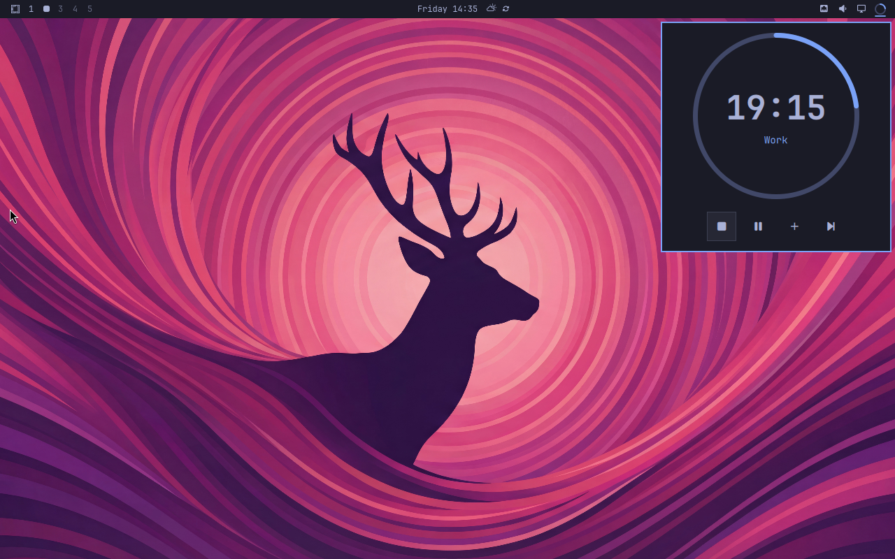

# Omadoro

Omadoro is a [Pomodoro](https://en.wikipedia.org/wiki/Pomodoro_Technique) timer
for the [Omarchy](https://omarchy.org/) bar.



## Install

```bash
omarchy plugin add https://github.com/brianblakely/omadoro.git --enable --yes
```

## Use

Click the bar icon to open the timer panel.

| Button    | Action                                    |
| --------- | ----------------------------------------- |
| `` / `` | Start a new cycle or stop the current one |
| `` / `` | Pause or resume                           |
| `󰐕`       | Add five minutes                          |
| ``       | Skip to the next phase                    |

When the timer is stopped, press Play to begin a fresh cycle. Omadoro switches
between work and break phases automatically and sends a notification when the
next phase begins.

The default cycle is:

- 25 minutes of work
- 5-minute short breaks
- A 15-minute long break after four work phases

## Keyboard controls

With the panel open:

- Use the arrow keys or `h`, `j`, `k`, and `l` to select a button.
- Press Enter or Space to activate it.
- Press Escape to close the panel.
- Press Tab or Shift+Tab to move between bar panels.

You can also control the panel from a terminal or your own keybinding:

```bash
omarchy-shell shell toggle b.omadoro
```

## Customize

Change the phase lengths and long-break frequency through Omarchy:

```bash
omarchy bar plugin set b.omadoro workMinutes 25 --json
omarchy bar plugin set b.omadoro shortBreakMinutes 5 --json
omarchy bar plugin set b.omadoro longBreakMinutes 15 --json
omarchy bar plugin set b.omadoro workPhasesPerLongBreak 4 --json
```

New values apply from the next phase onward.

## Update

```bash
omarchy plugin update b.omadoro
```

## Uninstall

```bash
omarchy plugin remove b.omadoro
```
